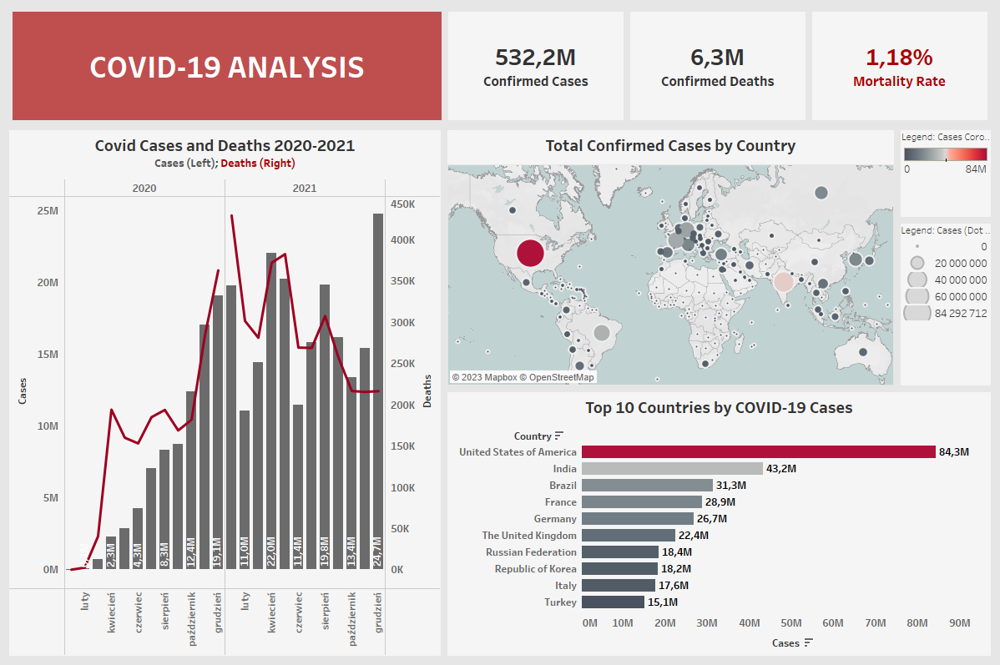

# Covid-19 Analysis

### Project Overview
---
This project provides insights into Covid-19 global statistics of the infected, as well as the fatalities.

 The dashboard illustrates the distribution of the number of cases and deaths from 2021 to 2022, and with the help of the cartogram included, it is also possible to track the number of cases in all of the countries. In addition, a mortality rate was calculated based on the number of cases and deaths due to Covid-19.

The dashboard was made using the Tableau tool.

A preview of the dashboard below:

### Data Sources

The primary dataset used for the analysis was downloaded from [official WHO](https://covid19.who.int/data) site.
